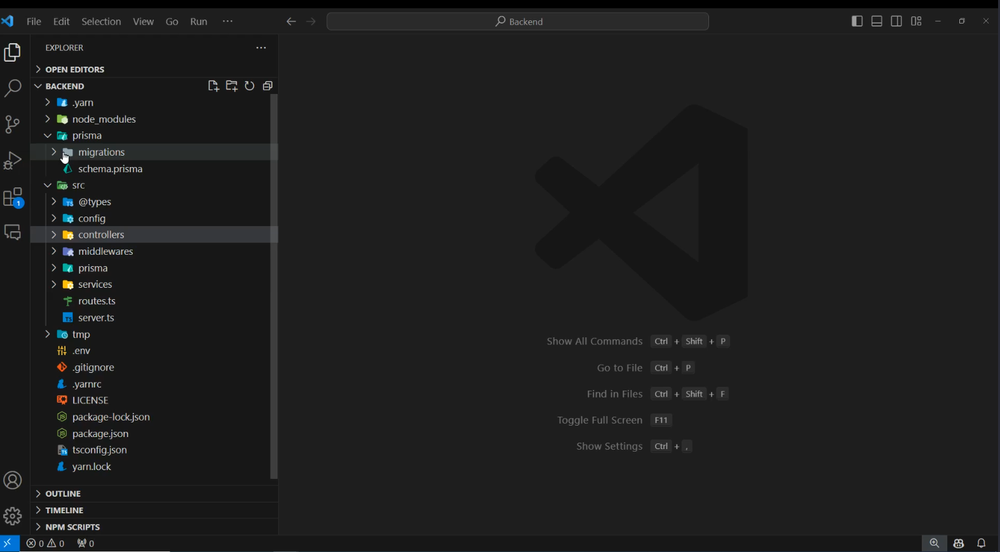
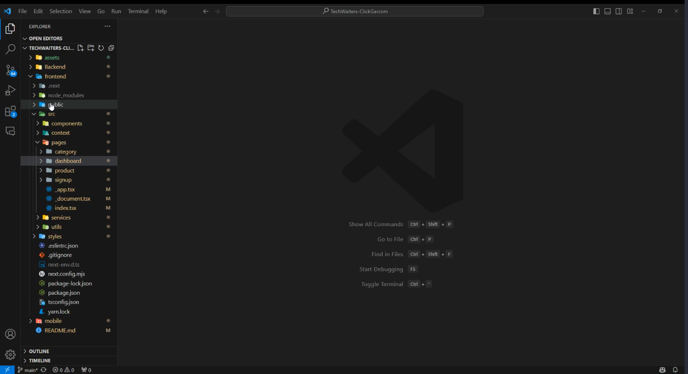
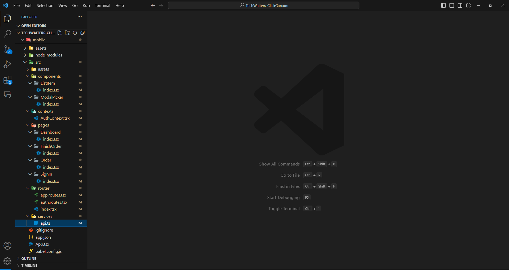

# TechWaiters-ClickGarcom

### Problema:

Em muitos restaurantes, a comunicação entre o garçom e a equipe de cozinha pode ser um desafio. Os pedidos dos clientes são frequentemente transmitidos verbalmente ou em papel, o que pode levar a erros de interpretação, atrasos na preparação dos pratos e, consequentemente, insatisfação dos clientes.

### Solução:

Por isso, a equipe ClickGarçom decidiu criar uma solução eficiente para facilitar a comunicação entre o garçom e a equipe da cozinha, reduzindo erros e atrasos na preparação dos pedidos dos clientes. 

Desenvolvemos um sistema intuitivo e fácil de usar, no qual o garçom pode registrar os pedidos diretamente em um dispositivo, como um tablet ou smartphone. Os pedidos são então enviados instantaneamente para a equipe da cozinha, eliminando a necessidade de comunicação verbal ou papelada.

### Principais recursos:

Além das funções básicas, nossa equipe dicidiu ir além e criou um sistema completamente personalizado, para antender todos os tipos de restaurantes, já que é possível registrar previamente todos os produtos do cardápio do seu estabelicimento. Entre os principais recursos estão:

- Interface Intuitiva: O sistema possui uma interface simples e intuitiva, projetada para facilitar o processo de registro de pedidos pelo garçom.

- Comunicação Instantânea: Os pedidos são transmitidos instantaneamente para a equipe da cozinha, garantindo uma resposta rápida e eficiente.

- Controle dos produtos: Os produtos são cadastrados préviamente, com nome, foto, preço e descrição.

- Personalização de Pedidos: O sistema permite a personalização detalhada de cada pedido, incluindo modificações de pratos, solicitações especiais, etc.

- Gerenciamento de Pedidos: Os pedidos são organizados e gerenciados de forma eficiente, permitindo que a equipe da cozinha acompanhe o status de cada pedido em tempo real.


### Benefícios:

- Redução de Erros: A comunicação direta e precisa dos pedidos reduz significativamente os erros de interpretação e preparação.

- Eficiência Operacional: O sistema agiliza o processo de pedidos, permitindo que a equipe da cozinha se concentre na preparação dos pratos, melhorando assim a eficiência operacional.

- Melhor Experiência do Cliente: Pedidos mais precisos e uma preparação mais rápida resultam em uma experiência geral mais satisfatória para os clientes.

Nosso projeto visa revolucionar a maneira como os restaurantes atendem seus clientes, introduzindo uma solução tecnológica que agiliza e aprimora significativamente a experiência de atendimento. Através de nossa aplicação, garçons podem registrar pedidos utilizando dispositivos eletrônicos, como smartphones ou tablets, e enviar essas informações diretamente para a cozinha. Este processo não apenas reduz o tempo de espera para os clientes, mas também aumenta a eficiência do serviço prestado, assegurando que os pedidos sejam preparados e entregues de forma mais rápida e precisa.

### Estrutura:

Para garantir uma implementação eficaz e uma experiência de usuário coesa, estruturamos o projeto em três componentes principais:

- **Back-end:** A espinha dorsal de nossa aplicação, responsável pela lógica de negócios, gestão de dados, e integração entre o front-end e o sistema da cozinha. Esta camada assegura que os pedidos sejam processados eficientemente e sem erros, transmitindo informações em tempo real.

- **Front-end:** A interface com a qual garçons interagem para registrar pedidos. Desenvolvida para ser intuitiva e fácil de usar, garante que a entrada de dados seja rápida e livre de complicações, melhorando a experiência do usuário.

- **Mobile:** Uma aplicação dedicada para dispositivos móveis, permitindo que os garçons tenham flexibilidade e mobilidade para atender os clientes em qualquer lugar do restaurante. Esta parte é essencial para a agilidade do serviço, oferecendo uma solução portátil e acessível.

Cada uma dessas partes foi cuidadosamente desenvolvida para trabalhar em conjunto de maneira harmoniosa, garantindo que nosso sistema não apenas atenda às necessidades atuais dos restaurantes, mas também seja escalável para futuras expansões ou funcionalidades adicionais. Ao adotar nossa solução, restaurantes podem esperar não apenas uma melhoria imediata na eficiência do atendimento, mas também uma base sólida para a inovação contínua no futuro.

# Documentação do Projeto

Este projeto inclui uma documentação detalhada para auxiliar no desenvolvimento e na utilização das funcionalidades oferecidas. 

Para mais informações, consulte a documentação completa [aqui](https://docs.google.com/document/d/1MifVlgZb4EPsAkzsf49Gy6FV06GMOI7jW3eas1vIzsk/edit).


# Estrutura de Backend
O back-end do nosso aplicativo é organizado em diretórios claros e funcionais que permitem fácil navegação e escalabilidade:

- **src:** Este é o diretório de origem que contém a lógica do aplicativo principal.
- **@types:** Contém declarações de tipo para TypeScript, melhorando a qualidade do código e a experiência do desenvolvedor.
- **config:** Armazena arquivos de configuração, como para upload de arquivos.multer.ts
controllers: Aqui está a lógica para lidar com solicitações de entrada e respostas de retorno. Cada categoria e tem seu próprio conjunto de controladores para gerenciar suas operações, **user**, **category**, **order**, **product**.
- **middlewares:** Contém funções de middleware como a que verifica se um usuário está autenticado.isAuthenticated.ts
- **prisma:** Inclui o esquema Prisma e migrações para gerenciamento de banco de dados.
- **services:** Os arquivos de serviço encapsulam a lógica de negócios, manipula a lógica para manipulação dos dados.
- **tmp:** Uma pasta temporária que pode ser usada para armazenar arquivos como logs ou uploads temporariamente.
- **user:** Demonstra uma abordagem modular onde cada domínio (como usuários) tem seu próprio conjunto de serviços e controladores.
- **prisma:** A pasta ORM (Object-Relational Mapping) contém arquivos de esquema e migração para estrutura de banco de dados e controle de versão.
- **node_modules:** Contém todos os pacotes npm e dependências usados no projeto.

### Arquivos de nível raiz:
- **.env:** Armazena variáveis de ambiente cruciais para proteger e configurar o aplicativo.
- **package.json & yarn.lock:** Defina dependências de projeto e bloqueie-as em versões específicas para consistência entre ambientes.
- **tsconfig.json:** Configura as opções do compilador TypeScript.
- **server.ts:** O ponto de entrada do aplicativo que configura o servidor.
  
Essa configuração de back-end garante uma separação de preocupações, tornando nosso aplicativo sustentável e escalável. Cada parte da base de código tem um propósito específico, garantindo que a equipe de desenvolvimento possa trabalhar de forma eficiente e paralela em diferentes recursos sem conflito.

## Instruções de configuração do Backend

1. Clone o repositório para sua máquina local.
2. Navegue até o diretório do projeto e instale as dependências:
   
```sh
yarn install
```
3. Configure seu arquivo com as variáveis de ambiente necessárias..env   
4. Execute o servidor de back-end:
```sh
yarn start
```

## Vídeo Demonstrativo

Clique no link abaixo para ver a demonstração do projeto Backend

[](assets/backend.mp4)


 Aproveite a eficiência aprimorada e a melhor experiência de atendimento ao cliente que nosso aplicativo traz para o seu restaurante!


 # Estrutura de Frontend

 Este documento descreve a estrutura e as funcionalidades do frontend para o nosso Aplicativo de Otimização de Serviço de Restaurante. O frontend foi projetado para fornecer uma interface de usuário perfeita para a equipe do restaurante e os clientes, permitindo uma interação eficiente e uma experiência gastronômica aprimorada.

## Estrutura do Projeto

No desenvolvimento do front-end da nossa aplicação de otimização de serviços de restaurante, utilizamos o Next.js, uma poderosa estrutura React que permite uma experiência de usuário aprimorada e uma performance otimizada. O Next.js facilita a construção de interfaces de usuário reativas e dinâmicas, suporta renderização no lado do servidor para carregamento rápido de páginas e melhoria no SEO, e também proporciona um roteamento integrado e suporte para geração de sites estáticos e aplicações web dinâmicas.

A estrutura de diretórios do Next.js no projeto está bem organizada, promovendo a modularidade e reutilização de componentes. Com isso, a interface da aplicação se torna responsiva e adaptável a diferentes dispositivos, garantindo uma ótima experiência tanto para a equipe do restaurante quanto para os clientes, e é organizado da seguinte maneira:

- **public**: Contém ativos estáticos como imagens de logotipo **('logoHeader.PNG' e 'LogoSemFundo.png')** que são usados em todo o aplicativo.

- **src:** O diretório fonte principal que abriga o núcleo do código frontend.
 - **components:** componentes reutilizáveis que compõem os blocos de construção da interface do usuário.
 - **Header:** Componente para o cabeçalho da aplicação, incluindo estilo com módulos SCSS.
 - **ui:** Subcomponentes como **'Button'** e **'Input'**, cada um com seu próprio estilo e lógica.
 - **context:** Contém arquivos de contexto como **'AuthContext.tsx'** para gerenciar o estado global, como autenticação de usuário.
 - **pages:** Componentes do React que se correlacionam com rotas do aplicativo.
 - **category:** uma secção para operações relacionadas com a categoria.
 - **dashboard:** A visualização principal do painel para usuários autenticados.
 - **product:** lida com a exposição e gestão de produtos.
 - **cadastro:** Contém a página de inscrição para novos usuários.
 - **services:** lida com a interação com serviços de back-end.
 - **erros:** tratamento de erros personalizado, como **'AuthTokenError.ts'**.
 - **api.ts e apiClient.ts:** Configure a comunicação da API.
 - **utils:** Funções utilitárias para verificações de autenticação de renderização do lado do servidor **('canSSRAuth.ts' e 'canSSRGuest.ts')**.
- **estilo:** estilos globais e módulos SCSS individuais para estilos específicos de componentes.

### Arquivos de nível raiz:
 - **package.json e yarn.lock:** Define e bloqueia dependências.
 - **tsconfig.json:** configuração do TypeScript.
 - **next.config.mjs:** Next.js arquivo de configuração.

## Recursos

- **Componentes de interface do usuário responsivos**: Os componentes da interface do usuário são construídos para se adaptar a diferentes tamanhos de tela, garantindo um layout responsivo para todos os usuários.
- **Global State Management**: Usando o React Context, gerenciamos o estado de autenticação em todo o aplicativo, fornecendo uma experiência personalizada para cada usuário.
- **Páginas dinâmicas**: Nosso aplicativo inclui várias páginas dinâmicas, cada uma ligada a um aspecto específico do gerenciamento de serviços de restaurantes, como visualização de categorias, gerenciamento de pedidos e navegação de produtos.
- **Integração API**: O frontend se comunica com o backend através de um conjunto de serviços, garantindo fluxo de dados e ações em tempo real, como fazer pedidos e atualizar informações de produtos.
- **SSR e Segurança**: Os utilitários de renderização do lado do servidor ajudam no carregamento do estado inicial do servidor, e verificações de segurança estão em vigor para proteger rotas privadas.

## Primeiros passos

Para executar o frontend localmente:

1. Clone o repositório e navegue até o diretório frontend.
2. Instale dependências com 'yarn install'.
3. Inicie o servidor de desenvolvimento usando 'yarn dev'.
4. Abra 'http://localhost:3000' para visualizá-lo no navegador.

Verifique se o serviço de back-end está em execução para que o front-end possa interagir com ele com êxito.

Esperamos que esta documentação ajude você a entender a estrutura e os recursos da parte frontend do nosso Aplicativo de Otimização de Serviço de Restaurante. O projeto visa oferecer uma experiência amigável, impulsionando a eficiência nas operações do restaurante.

## Vídeo Demonstrativo

Clique no link abaixo para ver a demonstração do projeto Frontend

[](assets/Frontend.mp4)

 # Estrutura do Mobile


Este documento serve como um guia para o componente móvel do nosso Aplicativo de Otimização de Serviço de Restaurante. Projetado para trabalhar em conjunto com nossos sistemas de back-end e frontend, este aplicativo móvel simplifica o processo de pedidos para a equipe do restaurante e melhora a experiência gastronômica para os clientes, oferecendo uma interface amigável e ferramentas de serviço eficientes em qualquer lugar.

## Estrutura do Projeto

O aplicativo móvel é desenvolvido usando o React Native, aproveitando sua capacidade de criar aplicativos multiplataforma para iOS e Android com uma única base de código. Aqui está uma visão geral da estrutura do projeto:

- **ativos:** Armazena todos os arquivos estáticos, como imagens e ícones usados dentro do aplicativo.
- **src:** O diretório de origem onde ocorre o desenvolvimento do aplicativo.
- **components:** componentes reutilizáveis como **'ListItem'** para exibir itens e **'ModalPicker'** para entradas de seleção.
 - **contexts:** Contém arquivos de contexto, incluindo **'AuthContext.tsx'**, para gerenciar o estado global, como a autenticação do usuário.
 - **páges:** Cada página representa uma tela dentro do aplicativo, como **'Dashboard'**, **'FinishOrder'** e **'Order'**, fornecendo funcionalidades específicas.
 - **routes:** Contém a lógica de roteamento com **'app.routes.tsx'** e **'auth.routes.tsx'** para lidar com a navegação com base no status de autenticação.

- **services:** inclui serviços como «api.ts» para comunicação de back-end.

### Arquivos de nível raiz:
- **'app.json':** Contém metadados sobre o aplicativo.
- **'babel.config.js':** Configura Babel, que transpila o código para garantir a compatibilidade.
- **'tsconfig.json':** Define a configuração do TypeScript.

## Principais recursos

- **Funcionalidade multiplataforma**: Construído para suportar as plataformas iOS e Android, oferecendo um amplo alcance.
- **Arquitetura de Componentes Modulares**: Melhora a facilidade de manutenção e legibilidade do código.
- **API de contexto para gerenciamento de estado**: simplifica o gerenciamento de estado em todo o aplicativo, fornecendo uma experiência de usuário mais coesa e responsiva.
- **Páginas dedicadas para funções principais**: telas individuais para tarefas como visualizar o painel, gerenciar pedidos e finalizar transações garantem um fluxo de trabalho focado.
- **Roteamento integrado**: Um sistema de navegação bem definido que se adapta ao status de autenticação do usuário.

## Primeiros passos

Para configurar o aplicativo móvel em seu ambiente local:

1. Certifique-se de ter o ambiente React Native configurado em sua máquina.
2. Clone o repositório para o seu dispositivo local.
3. Navegue até o diretório do aplicativo móvel e instale as dependências:
```Sh
# Instalar dependências com yarn
yarn install
```
4. Em seguida, para iniciar o aplicativo em um emulador ou dispositivo físico, você usaria:

```sh
# Iniciar o aplicativo com yarn
yarn start
```

5. Para compilar e executar o aplicativo no iOS, você usaria:

```sh
# Compilar e executar o aplicativo para iOS com yarn
yarn ios
```

6. E para o Android, seria:

```sh
# Compilar e executar o aplicativo para Android com yarn
yarn android
 ```

Esses comandos são padrão quando se está trabalhando com React Native e usando o gerenciador de pacotes yarn. Cada comando tem um propósito específico para a preparação e execução do aplicativo em diferentes plataformas e ambientes.

### Configurando o Endereço IP para Conexão com o Backend

Para que a aplicação móvel possa se comunicar com o servidor backend, você precisará especificar o endereço IP da máquina onde o servidor está rodando. Faça o seguinte:

1. Encontre o endereço IP do seu computador na rede local. Este endereço é geralmente atribuído pelo seu roteador e pode ser encontrado nas configurações de rede do seu sistema operacional ou visualizando os detalhes da sua conexão atual.

2. Abra o arquivo **'api.ts'** localizado em **'mobile/src/services'**.

3. Substitua o placeholder **'seu_ip'** pelo endereço IP que você encontrou. Por exemplo, se o seu IP for '192.168.1.10', a configuração ficaria assim:

```Typescript
 importar axios de "axios";

Const API = axios.create({
 baseURL: "http://xxx.xxx.x.xx:5000"
 });

exportar { api };
```

Certifique-se de que o backend esteja rodando na porta especificada (neste caso, '5000') e que seu firewall permita conexões nessa porta.

Lembre-se de não compartilhar o código com seu IP real publicamente, especialmente se estiver usando um endereço IP público, para evitar questões de segurança.

### Testando a Conexão

Para testar se a aplicação móvel está se comunicando corretamente com o backend, você pode:

- Usar um dispositivo físico conectado à mesma rede Wi-Fi que o seu computador. Escaneie o QR code gerado pelo comando 'yarn start' ou 'npm start' usando o aplicativo Expo no seu dispositivo.

- Utilizar um emulador no Android Studio. Certifique-se de que o emulador esteja configurado para usar a mesma rede que o seu servidor backend.

Com estas etapas, você garante que a aplicação móvel tenha acesso ao backend, permitindo um desenvolvimento e teste eficientes das funcionalidades do aplicativo.

Siga as instruções detalhadas no arquivo 'README.md' para obter mais informações sobre como navegar na base de código, contribuir para o projeto e implantar o aplicativo

## Vídeo Demonstrativo

Clique no link abaixo para ver a demonstração do projeto Mobile

[](assets/Mobile.mp4)


## Gerenciamento de Projeto no Trello

O gerenciamento de tarefas e a organização da equipe durante o desenvolvimento do projeto foram realizados utilizando o Trello. Para visualizar o andamento do projeto, acompanhar as tarefas e entender melhor a colaboração da equipe, acesse o quadro do projeto no Trello pelo link abaixo:

[Visualizar Quadro do Trello](https://trello.com/b/hy3mPVKc/click-garcom)


## Equipe do Projeto

Este projeto foi possível graças aos esforços colaborativos de uma equipe dedicada. Abaixo estão os membros da equipe que contribuíram para o desenvolvimento do aplicativo de otimização de serviços em restaurantes:

### [Felipe Gabriel Kretzer](https://github.com/kretzerfelipe "GitHub") 

98450_0086-WhatsApp-25D366?style=for-the-badge&logo=whatsapp&logoColor=white)

[](https://www.linkedin.com/in/felipe-gabriel-kretzer-dev/) 


### [Francine dos Santos](https://github.com/FranNinaa "GitHub") 

98441_5277-WhatsApp-25D366?style=for-the-badge&logo=whatsapp&logoColor=white)

[](https://www.linkedin.com/in/francine-santos-ti/) 


### [Stephanie Possamai](https://github.com/Stephanieposs "GitHub") 

99140_6344-WhatsApp-25D366?style=for-the-badge&logo=whatsapp&logoColor=white)

[](https://www.linkedin.com/in/stephanie-possamai) 


### [Aline Marques](https://github.com/lineMarques "GitHub") 

99995_3357-WhatsApp-25D366?style=for-the-badge&logo=whatsapp&logoColor=white)

[](whttps://www.linkedin.com/in/aline-marques/) 


### [Letícia Lima](https://github.com/Leticia "GitHub") 

99662_0610-WhatsApp-25D366?style=for-the-badge&logo=whatsapp&logoColor=white)

[](https://www.linkedin.com/in/let%C3%ADcia-de-lima-da-cunha-6160372a4/) 


### [Amabile](https://github.com/AmabileForster "GitHub") 

98462_8802-WhatsApp-25D366?style=for-the-badge&logo=whatsapp&logoColor=white)

[](https://www.linkedin.com/in/amabilemartendal/) 


Agradecemos a todos os que contribuíram com seu tempo, energia e habilidades para tornar este projeto um sucesso.

# Agradecimentos Especiais
Gostaríamos de expressar nossa mais profunda gratidão ao Professor [Ivan J. Borchardt](https://www.linkedin.com/in/ivan-borchardt/) por sua orientação indispensável, sua paixão pelo ensino e dedicação ao conhecimento nos inspiraram a cada passo do caminho. 
Além disso, somos imensamente agradecidos ao projeto [Entra 21](https://www.entra21.com.br/) por nos fornecer os recursos e o ambiente que nos permitiram crescer, inovar e transformar nossas ideias em uma solução tangível. Esse conjunto de suporte e educação foi o combustível que impulsionou nossa jornada e nos ajudou a alcançar os objetivos estabelecidos. Obrigado por acreditar em nosso potencial e por nos equipar com as ferramentas necessárias para navegar no mundo da tecnologia.


